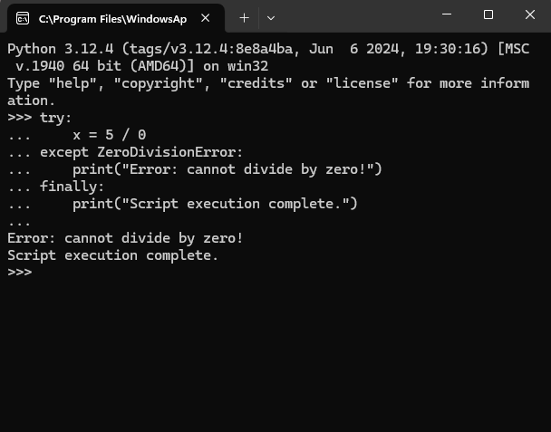
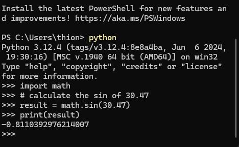

# SE-Assignment-6
 Assignment: Introduction to Python
Instructions:
Answer the following questions based on your understanding of Python programming. Provide detailed explanations and examples where appropriate.

 Questions:

1. Python Basics:
   - What is Python, and what are some of its key features that make it popular among developers? Provide examples of use cases where Python is particularly effective.

      Python is a high-level programming language known for its readability and simplicity.
      Some of it's key features are: dynamic typing, cross platform, interpreted (runs code line by line), versatility, readability

      Use Cases examples are: 
      - Web development: Frameworks like Django and Flask make building web applications straightforward and efficient.
      - Software Development: Ideal for developing desktop applications and games
      - Scientific Computing: Widely used in research for data analysis and simulation.

2. Installing Python:
   - Describe the steps to install Python on your operating system (Windows, macOS, or Linux). Include how to verify the installation and set up a virtual environment.

      How to install python on windows 
      steps:
      - download python from the official website 
      - once the download is done install python on your pc, while installing check (add python to PATH)
      - to verify open commnd prompt and type (python --version)
      - to set up a venv open command prompt, go to your project directory (cd path/to/your/project) > (python -m venv venv) > (venv\scripts\activate)

3. Python Syntax and Semantics:
   - Write a simple Python program that prints "Hello, World!" to the console. Explain the basic syntax elements used in the program.

      - # Simple Python program to print Hello, World!
         print("Hello, World!")
      - Comments starts with a (#) and are ignored by python interpreter, they are used to make notes.
      - {print()} is a built-in Python function that outputs (prints) a specified message or value to the console
      - '"Hello, World!"' is a string literal enclosed in double quotes ("). In Python, strings are sequences of characters, and they can be enclosed in either single quotes (') or double quotes (").

4. Data Types and Variables:
   - List and describe the basic data types in Python. Write a short script that demonstrates how to create and use variables of different data types.

      data types:
      - Integer ('int') represent whole numbers both +ve and -ve 
      - String ('str') represent a sequence of character enclosed in a single or double quates (') (")
      - Boolean (bool) represent a binary value indicating 'true' or 'false'
      - List represent an ordered collection of items and can be of diffrent types 
      - Dictionary (dict) reprecent a key o values pairs 
         # Integer variable
         age = 25

         # String variables
         name = 'Alice'
         greeting = "Hello, World!"

         # Boolean variable
         is_student = True

         # List variable
         fruits = ['apple', 'banana', 'cherry']

         # Dictionary variable
         person = {'name': 'Bob', 'age': 30}

         # Printing variables to demonstrate their values
         print("Age:", age)
         print("Name:", name)
         print("Greeting:", greeting)
         print("Is student?", is_student)
         print("Fruits:", fruits)
         print("Person:", person)

5. Control Structures:
   - Explain the use of conditional statements and loops in Python. Provide examples of an `if-else` statement and a `for` loop.

      `if-else` statement executes a block of code if a certain condition is true, and another block of code if the condition is false
      Example: 
            x = 5
            if x > 10:
            print("x is greater than 10")
            else:
            print("x is less than or equal to 10")
             `x is less than or equal to 10`
      Loops are used to execute a block of code repeatedly for a specified number of times.
      `for` loop loops through a sequence (such as a list or string) and executes a block of code for each item in the sequence
      Example:
            numbers = [1, 2, 3, 4, 5]
            for num in numbers:
            print(num * 2)
         # output
            2
            4
            6
            8
            10

6. Functions in Python:
   - What are functions in Python, and why are they useful? Write a Python function that takes two arguments and returns their sum. Include an example of how to call this function.

      Functions in Python are blocks of code that can be executed multiple times from different parts of your program they are useful for code reusability, modularity, readability, and reusability.
      Example:
         >>> def add_numbers(a, b):
         ...   return a + b

         # Calling the Function
         >>> result = add_numbers(6, 3)
         >>> print(result) 
         # output
            9

7. Lists and Dictionaries:
   - Describe the differences between lists and dictionaries in Python. Write a script that creates a list of numbers and a dictionary with some key-value pairs, then demonstrates basic operations on both.

      In Python, lists are ordered, mutable collections of items accessible by index, allowing duplicates whereas Dictionaries are unordered, mutable collections of unique key-value pairs, providing rapid lookups by key.
      Example:
         # list of numbers.
            my_list = [1, 2, 3, 4, 5]

         #  dictionary with some key-value pairs
            my_dict = {"name": "Sam", "age": 25, "city": "Nairobi"}

         # operation of both rrespectively
            print("List operations:")
            print(my_list[0]) 
         # output 
            1

            my_list.append(6) 
            print(my_list) 
         # Output
             [1, 2, 3, 4, 5, 6]

            print("\nDictionary operations:")
            print(my_dict["name"])
         # output
            Sam

            print(my_dict)
         # output
            {'name': 'Sam', 'age': 25, 'city': 'Nairobi'}

8. Exception Handling:
   - What is exception handling in Python? Provide an example of how to use `try`, `except`, and `finally` blocks to handle errors in a Python script.

      Exception handling in Python is a mechanism for detecting and responding to runtime errors in a program. It allows you to catch and handle unexpected conditions, such as errors or exceptions, that might occur during script execution

      Example:
         

9. Modules and Packages:
   - Explain the concepts of modules and packages in Python. How can you import and use a module in your script? Provide an example using the `math` module.

      Module is a file that contains a collection of related functions, variables, and classes
      Package is a directory that contains multiple modules and subpackages
      To import a module in Python, you can use the `import` statement
      # example using the `math` module.
         import math 
         # calculate the sin of 30.47
         result = math.sin(30.47)
         print(result)
         # output
         -0.8110392976214007
         # Executed example 
         

10. File I/O:
    - How do you read from and write to files in Python? Write a script that reads the content of a file and prints it to the console, and another script that writes a list of strings to a file.

      To read from a file in Python, you open the file in read mode ('r') and use methods like read(), readline(), or readlines() to access its content.

      To write to a file, you open it in write mode ('w') or append mode ('a'), then use the write() method to add content to the file.

         

# Submission Guidelines:
- Your answers should be well-structured, concise, and to the point.
- Provide code snippets or complete scripts where applicable.
- Cite any references or sources you use in your answers.
- Submit your completed assignment by [due date].

